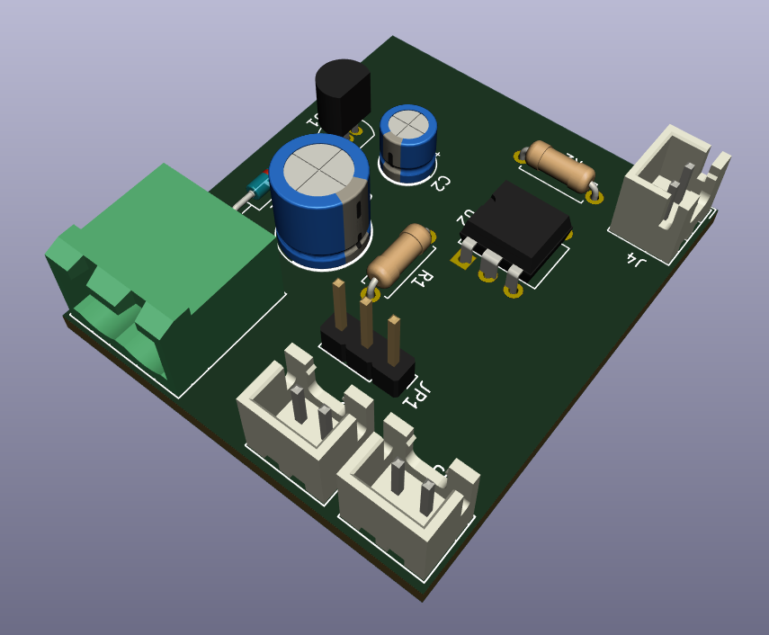

# 3D printer laser adapter

This circuit needs to adapt a PWM/TTL laser module to a 3D printer using a cooling fan output.
You need to use a laser which has the PWM/TTL control on a port different from the one used for the power.

You can turn the laser ON with GCODE command `M106 Sxxx` (where `xxx` is an integer number from 0 and 255) and the laser OFF with `M107`

For example:
```
M106 S127 ; This line turns the laser ON to half power (50%)
M106 S255 ; This line turns the laser ON to full power (100%)
M107 ; This line turns the laser OFF
M106 S0 ; This line turns the laser OFF too (0%)
```

Through the use of JP1 jumper you can switch from Laser to Fan, so you don't need to detach this interface to use your printer normally.



# 12V or 24V printer

If your FAN runs at 24V R1 must be 2.2KOhm, if it runs at 12V R1 must be 1.1KOhm.

Note that JST (white) connectors are rotated to respect Creality 3D Ender 3 PRO polarity, so if your printer has inverted polarity rotate the JST connectors accordingly.
